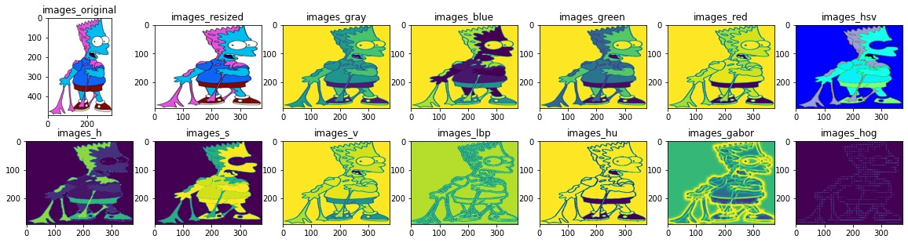
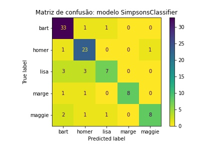

# Simpsons Classification

<div align="center">
    </img>
</div>

## Objetivo 🎯
Classificar os personagens dos Simpsons utilizando modelos de Machine Learning.

<div align="center">
    <table>
        <tr>
            <td>Personagem</td>
            <td>Classe</td>
        </tr>
        <tr>
            <td>Bart</td>
            <td>0</td>
        </tr>
        <tr>
            <td>Homer</td>
            <td>1</td>
        </tr>
        <tr>
            <td>Lisa</td>
            <td>2</td>
        </tr>
        <tr>
            <td>Marge</td>
            <td>3</td>
        </tr>
        <tr>
            <td>Maggie</td>
            <td>4</td>
        </tr>
    </table>
</div>

## Processamento das imagens 🖼
Os dados foram carregados utilizando a classe `ImagesLoader` do módulo `data_loader.load_data.py`, lendo as imagens de treino e teste a partir do caminho especificado. Os dados são armazenados em um dicionário (`dict`) que contém o nome dos arquivos, nomes dos personagens, caminhos dos arquivos, imagens originais, redimensionadas, descritores das imagens, entre outras variações. Trata-se de uma compilação de todos os dados a serem testados em diferentes modelos.

Exemplos de descritores utilizados e outros componentes das imagens:
- Local Binary Patterns (LBP);
- Hu moments;
- Gabor filters;
- HOG;
- Histogramas RGB;
- Histogramas HSV;

<div align="center">
    </img>
</div>

## Pipelines ⚙
A escolha dos dados que serão utilizados por cada modelo não foi completamente aleatória. Foram executadas várias *pipelines* de modelos, para cada um dos campos de dados carregados (exceto os dados das imagens em si, apenas descritores, histogramas e combinações). Em cada um dos modelos testados, foi utilizado o objeto `Pipeline` do `sklearn`, criando uma *pipeline* com o modelo em si e um `StandardScaler`, normalizando os dados entre 0 e 1, e então conduzindo o processo (treino e teste). Além do mais, cada *pipeline* utilizou os seguintes modelos:
- `KNeighborsClassifier()`
- `GaussianNB()`
- `LinearSVC()`
- `SVC()`
- `LogisticRegression()`
- `RandomForestClassifier()`
- `LGBMClassifier()`
- `XGBClassifier()`
- `AdaBoostClassifier()`
- `ExtraTreesClassifier()`
- `MLPClassifier()`
- `DummyClassifier(strategy='stratified')`

### Executando uma pipeline
```bash
cd ./experiments
```

```bash
python .\ml_pipeline.py --dataset '<NOME_DO_DATASET>' --data_format 'CAMPO_DO_DICIONÁRIO' --load_type '[disk|memory]'
```

O exemplo abaixo executa uma *pipeline* utilizando o *dataset* `simpsons-small-balanced` e o campo `descriptor_rgb+hsv+lbp`, carregando os dados do disco, através do arquivo `pickle`.

```bash
python .\ml_pipeline.py --dataset 'simpsons-small-balanced' --data_format 'descriptor_rgb+hsv+lbp' --load_type 'disk'
```

A execução da *pipeline* será salva em `log`, no diretório `./logs/<NOME_DO_DATASET>.log`.

### Exemplos de `log` gerado

Segue abaixo o exemplo de um `log` gerado, após a conclusão (com ou sem erros) da *pipeline* descrita acima:

```bash
pipeline "descriptor_blue" finished with SUCCESS; time elapsed=40.4574s
pipeline "descriptor_green" finished with SUCCESS; time elapsed=41.5765s
pipeline "descriptor_red" finished with SUCCESS; time elapsed=41.0123s
```

## Métrica utilizada 📈
A métrica escolhida para avaliar os modelos foi o F1 *score*, mais precisamente a média ponderada entre os F1 *scores* (**weighted F1 score**) das diferentes classes.

$$F1 = 2 \cdot \frac{precision \cdot recall}{precision + recall}$$

$$\overline{F1} = \frac{(F1_x \cdot |x|) + (F1_y \cdot |y|) + \dots}{x + y + \dots}$$

$$\overline{F1} = \left( \sum_{i=0}^{n}F1_{k_i} \cdot |k_i| \right) \cdot \left( \sum_{i=0}^{n} \frac{1}{k_i} \right), \ \ k=\{x, \ y, \ z, \dots\}$$

Onde
- $k$: Conjunto das classes;
- $x$: Classe $x$;
- $|x|$: Cardinalidade da classe $x$, ou seja, número de exemplos que a compõe;

## Criação do modelo 🛠
O modelo criado é composto por três `StackingClassifier` treinados com combinações diferentes de dados. Cada *stack* é composta pelos seguintes modelos:

- `LinearSVC`
- `MLPClassifier`
- `LogisticRegression`
- `XGBClassifier`
- `LGBMClassifier`

Esses `StackingClassifier` criados foram treinados, respectivamente, com os dados da combinação de histogramas e descritores, são eles: HSV+HU, HSV+HU+LBP e HSV. Por fim, as predições de cada *stack* foram unificadas através de um sistema ponderado de votações, com pesos atribuídos de maneira distinta entre as classes.

## Resultados obtidos 🎯

O modelo foi capaz de **acertar 81% das imagens**, apresentando um **weighted F1 score** de **0.8**. Segue abaixo a matriz de confusão com os acertos e erros do modelo:

<div align="center">
    </img>
</div>

## The Simpsons Challenge 🏆

O desafio visa conseguir a maior pontuação para o **weighted F1 score**. O exemplo abaixo executa o *script* que gera o arquivo de predições, passando os arquivos `train.txt` e `test.txt` com os respectivos caminhos das imagens de treino e teste de entrada, salvando as predições em `predictions.txt`.

```bash
cd ./challenge
```

```bash
python .\simpsons.py --train 'train.txt' --test 'test.txt' --output 'predictions.txt'
```
